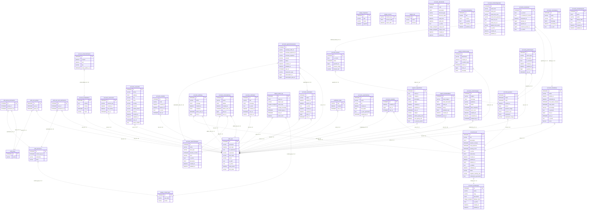

# Database Schema Diagram

```mermaid
erDiagram
    django_migrations {
        INTEGER id PK
        varchar app
        varchar name
        datetime applied
    }
    auth_group_permissions {
        INTEGER id PK
        INTEGER group_id
        INTEGER permission_id
    }
    auth_group_permissions }|..|| auth_permission : "permission_id -> id"
    auth_group_permissions }|..|| auth_group : "group_id -> id"
    auth_user_groups {
        INTEGER id PK
        INTEGER user_id
        INTEGER group_id
    }
    auth_user_groups }|..|| auth_group : "group_id -> id"
    auth_user_groups }|..|| auth_user : "user_id -> id"
    auth_user_user_permissions {
        INTEGER id PK
        INTEGER user_id
        INTEGER permission_id
    }
    auth_user_user_permissions }|..|| auth_permission : "permission_id -> id"
    auth_user_user_permissions }|..|| auth_user : "user_id -> id"
    account_emailconfirmation {
        INTEGER id PK
        datetime created
        datetime sent
        varchar key
        INTEGER email_address_id
    }
    account_emailconfirmation }|..|| account_emailaddress : "email_address_id -> id"
    account_emailaddress {
        INTEGER id PK
        bool verified
        bool primary
        INTEGER user_id
        varchar email
    }
    account_emailaddress }|..|| auth_user : "user_id -> id"
    accounts_usersession {
        INTEGER id PK
        varchar session_key
        datetime created_at
        datetime last_activity
        INTEGER user_id
    }
    accounts_usersession }|..|| auth_user : "user_id -> id"
    accounts_userprofile {
        INTEGER id PK
        varchar phone
        TEXT address
        varchar city
        varchar state
        varchar country
        varchar pincode
        varchar profile_picture
        decimal balance
        datetime created_at
        datetime updated_at
        INTEGER user_id
        bool email_verified
    }
    accounts_userprofile }|..|| auth_user : "user_id -> id"
    accounts_emailotp {
        INTEGER id PK
        varchar code
        datetime created_at
        datetime expires_at
        bool is_used
        INTEGER user_id
    }
    accounts_emailotp }|..|| auth_user : "user_id -> id"
    accounts_subscriptionplan {
        INTEGER id PK
        varchar name
        varchar plan_type
        INTEGER duration_months
        decimal price
        bool is_active
        TEXT description
        datetime created_at
        datetime updated_at
    }
    accounts_paymenttransaction {
        INTEGER id PK
        varchar razorpay_order_id
        varchar razorpay_payment_id
        varchar razorpay_signature
        decimal amount
        varchar status
        datetime created_at
        datetime updated_at
        INTEGER user_id
        varchar transaction_type
        bigint subscription_id
        bigint subscription_plan_id
    }
    accounts_paymenttransaction }|..|| accounts_subscriptionplan : "subscription_plan_id -> id"
    accounts_paymenttransaction }|..|| accounts_subscription : "subscription_id -> id"
    accounts_paymenttransaction }|..|| auth_user : "user_id -> id"
    accounts_subscription {
        INTEGER id PK
        varchar status
        datetime started_at
        datetime expires_at
        bool is_active
        datetime created_at
        datetime updated_at
        bigint plan_id
        INTEGER user_id
    }
    accounts_subscription }|..|| auth_user : "user_id -> id"
    accounts_subscription }|..|| accounts_subscriptionplan : "plan_id -> id"
    accounts_testcategory {
        INTEGER id PK
        varchar name
        varchar slug
        TEXT description
        integer_unsigned display_order
        bool is_active
        datetime created_at
        datetime updated_at
    }
    accounts_adminlog {
        INTEGER id PK
        varchar action
        TEXT message
        datetime created_at
        TEXT metadata
        INTEGER admin_user_id
        bigint test_id
    }
    accounts_adminlog }|..|| accounts_test : "test_id -> id"
    accounts_adminlog }|..|| auth_user : "admin_user_id -> id"
    accounts_subscriptionlog {
        INTEGER id PK
        varchar action
        TEXT details
        datetime created_at
        INTEGER admin_user_id
        bigint plan_id
        INTEGER user_id
    }
    accounts_subscriptionlog }|..|| auth_user : "user_id -> id"
    accounts_subscriptionlog }|..|| accounts_subscriptionplan : "plan_id -> id"
    accounts_subscriptionlog }|..|| auth_user : "admin_user_id -> id"
    accounts_notification {
        INTEGER id PK
        varchar title
        TEXT message
        bool is_read
        datetime created_at
        INTEGER user_id
        varchar action_url
    }
    accounts_notification }|..|| auth_user : "user_id -> id"
    django_admin_log {
        INTEGER id PK
        TEXT object_id
        varchar object_repr
        smallint_unsigned action_flag
        TEXT change_message
        INTEGER content_type_id
        INTEGER user_id
        datetime action_time
    }
    django_admin_log }|..|| auth_user : "user_id -> id"
    django_admin_log }|..|| django_content_type : "content_type_id -> id"
    django_content_type {
        INTEGER id PK
        varchar app_label
        varchar model
    }
    auth_permission {
        INTEGER id PK
        INTEGER content_type_id
        varchar codename
        varchar name
    }
    auth_permission }|..|| django_content_type : "content_type_id -> id"
    auth_group {
        INTEGER id PK
        varchar name
    }
    auth_user {
        INTEGER id PK
        varchar password
        datetime last_login
        bool is_superuser
        varchar username
        varchar last_name
        varchar email
        bool is_staff
        bool is_active
        datetime date_joined
        varchar first_name
    }
    django_session {
        varchar session_key PK
        TEXT session_data
        datetime expire_date
    }
    django_site {
        INTEGER id PK
        varchar name
        varchar domain
    }
    accounts_question {
        INTEGER id PK
        INTEGER marks
        INTEGER order
        datetime created_at
        bigint test_id
        varchar question_image
        TEXT question_text
        TEXT explanation
        varchar explanation_image
    }
    accounts_question }|..|| accounts_test : "test_id -> id"
    accounts_answer {
        INTEGER id PK
        bool is_correct
        INTEGER order
        bigint question_id
        varchar answer_image
        varchar answer_text
    }
    accounts_answer }|..|| accounts_question : "question_id -> id"
    accounts_testattempt {
        INTEGER id PK
        varchar status
        datetime started_at
        datetime submitted_at
        INTEGER time_taken_minutes
        INTEGER total_marks
        decimal percentage
        bool is_passed
        bigint test_id
        INTEGER user_id
        bool is_timed
        decimal score
    }
    accounts_testattempt }|..|| auth_user : "user_id -> id"
    accounts_testattempt }|..|| accounts_test : "test_id -> id"
    accounts_referralcode {
        INTEGER id PK
        varchar code
        TEXT description
        varchar discount_type
        decimal discount_value
        datetime valid_from
        datetime valid_until
        bool is_active
        integer_unsigned usage_limit
        integer_unsigned usage_count
        datetime created_at
        datetime updated_at
    }
    authtoken_token {
        varchar key PK
        datetime created
        INTEGER user_id
    }
    authtoken_token }|..|| auth_user : "user_id -> id"
    accounts_privacypolicy {
        INTEGER id PK
        varchar title
        TEXT content
        bool is_active
        datetime created_at
        datetime updated_at
    }
    accounts_systembackup {
        INTEGER id PK
        varchar name
        varchar file
        datetime created_at
        bigint size_bytes
        bool is_auto_generated
        INTEGER created_by_id
    }
    accounts_systembackup }|..|| auth_user : "created_by_id -> id"
    accounts_emailconfiguration {
        INTEGER id PK
        varchar email_host
        INTEGER email_port
        varchar email_host_user
        varchar email_host_password
        bool email_use_tls
        bool email_use_ssl
        varchar default_from_email
        bool is_active
        datetime created_at
        datetime updated_at
    }
    accounts_useranswer {
        INTEGER id PK
        bool is_correct
        bool is_marked_for_review
        datetime answered_at
        bigint attempt_id
        bigint question_id
        bigint selected_answer_id
        bool is_visited
    }
    accounts_useranswer }|..|| accounts_answer : "selected_answer_id -> id"
    accounts_useranswer }|..|| accounts_question : "question_id -> id"
    accounts_useranswer }|..|| accounts_testattempt : "attempt_id -> id"
    accounts_test {
        INTEGER id PK
        varchar title
        TEXT description
        INTEGER duration_minutes
        INTEGER total_questions
        INTEGER passing_score
        bool is_active
        TEXT instructions
        datetime created_at
        datetime updated_at
        bigint category_id
        bool is_hidden
        datetime published_at
        varchar status
        varchar negative_marking_rule
        bool notifications_generated
    }
    accounts_test }|..|| accounts_testcategory : "category_id -> id"
    accounts_savedtest {
        INTEGER id PK
        datetime created_at
        bigint test_id
        INTEGER user_id
    }
    accounts_savedtest }|..|| auth_user : "user_id -> id"
    accounts_savedtest }|..|| accounts_test : "test_id -> id"
    accounts_contactquery {
        INTEGER id PK
        varchar name
        varchar email
        TEXT message
        datetime submitted_at
        bool is_read
    }
    support_supportticket {
        INTEGER id PK
        char ticket_id
        varchar category
        TEXT description
        varchar status
        datetime created_at
        datetime updated_at
        INTEGER user_id
        varchar subject
        datetime admin_typing_until
        datetime user_typing_until
        bool is_read_by_admin
    }
    support_supportticket }|..|| auth_user : "user_id -> id"
    support_ticketmessage {
        INTEGER id PK
        varchar attachment
        datetime created_at
        bool is_admin_reply
        INTEGER sender_id
        bigint ticket_id
        TEXT message
    }
    support_ticketmessage }|..|| support_supportticket : "ticket_id -> id"
    support_ticketmessage }|..|| auth_user : "sender_id -> id"
    support_ticketfeedback {
        INTEGER id PK
        varchar ticket_subject
        TEXT ticket_description
        varchar ticket_id
        INTEGER rating
        TEXT feedback_text
        datetime created_at
        INTEGER user_id
    }
    support_ticketfeedback }|..|| auth_user : "user_id -> id"
    accounts_questionreport {
        INTEGER id PK
        varchar report_type
        TEXT description
        bool is_resolved
        datetime created_at
        datetime updated_at
        bigint question_id
        INTEGER user_id
    }
    accounts_questionreport }|..|| auth_user : "user_id -> id"
    accounts_questionreport }|..|| accounts_question : "question_id -> id"
    accounts_motivationquote {
        INTEGER id PK
        TEXT quote
        varchar author
        date display_date
        bool is_active
        datetime created_at
        datetime updated_at
    }
    accounts_emailcampaign {
        INTEGER id PK
        varchar subject
        TEXT message
        varchar audience
        varchar status
        INTEGER total_recipients
        INTEGER sent_count
        datetime created_at
        datetime completed_at
        INTEGER created_by_id
    }
    accounts_emailcampaign }|..|| auth_user : "created_by_id -> id"
```
